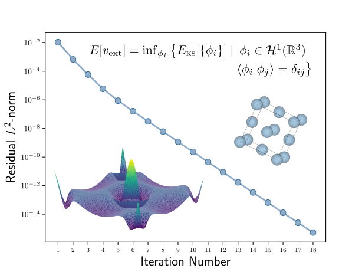

Documentation for pcask1d
==========================

|license| |docs| |build|

**Quantum Chemistry in one-dimension with a plane-wave basis set and periodic boundary conditions**

|convergence|

.. toctree::
   :maxdepth: 2
   :caption: Contents:

   introduction
   examples
   license
   help
   modules   

Introduction
============

``pcask1d`` is a python package designed to perform toy one-dimensional, periodic
density functional theory calculations. A calculation is designed to be constructed
around the following derived data-types: ``Parameters``, ``Wavefunction``,
``Density``, ``Hamiltonian``, and ``SCF``. The autogenerated documentation for these
classes is found in the Python API section.

Theory
======

The many-body non-interacting DFT Hamiltonian in a plane-wave basis set is defined via

.. math::
    \langle G + k | H | G' + k \rangle = \frac{1}{2} |G + k|^2 + \tilde{v}_{\text{ks}}(G-G').

Inside the Kohn-Sham potential is contained the Hartree potential (how the
constituant particles interact) and the static external potential inside which these particles
live. To avoid the :math:`G=0` divergence, the Coulomb kernel is softened,

.. math::
    f_h(|x-x'|) = \frac{1}{|x-x'| + c},

which constitutes a simple pseudopotential. Indeed, the Hartree potential and Coulomb
interaction is constant in one-dimension when constructed similarly to three dimensions.
Therefore, the softened inverse distance interactions here highlights the `toy` nature
of the code.

When the external potential has been defined (in real-space) by the user, the ``Hamiltonian``
class can be used to extract the explicit matrix representation of the plane-wave Hamiltonian.
One can then call ``Hamiltonian.eigendecomposition`` to extract the wavefunctions at a given
input density, and k-point, into the ``Wavefunction`` type. From the wavefunctions, the output density can
be constructed via ``Wavefunction.get_density``. To iterate toward self-consistency, this can be done either manually or using the
iterable ``SCF`` class. Other than the slight caveats regarding Coulomb potentials in one-dimension,
the rest of this code follows standard theory from, for example, Martin (2004).

.. |license| image:: https://img.shields.io/badge/License-MIT-green.svg
   :target: https://opensource.org/licenses/MIT

.. |docs| image:: https://readthedocs.org/projects/pcask1d/badge/?version=latest
   :target: https://pcask1d.readthedocs.io/en/latest/?badge=latest

.. |build| image:: https://travis-ci.org/NickWoods1/pcask1d.svg?branch=master
   :target: https://travis-ci.org/NickWoods1/pcask1d.svg?branch=master

